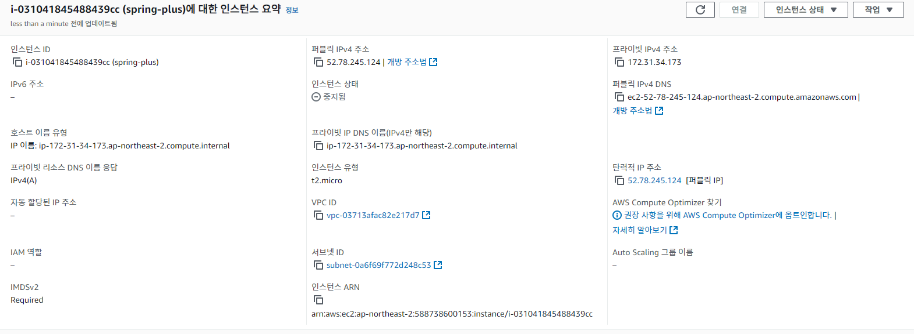
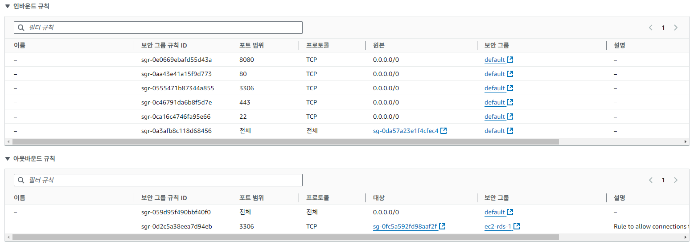
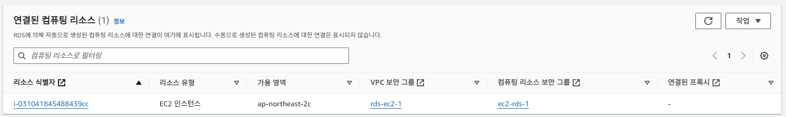
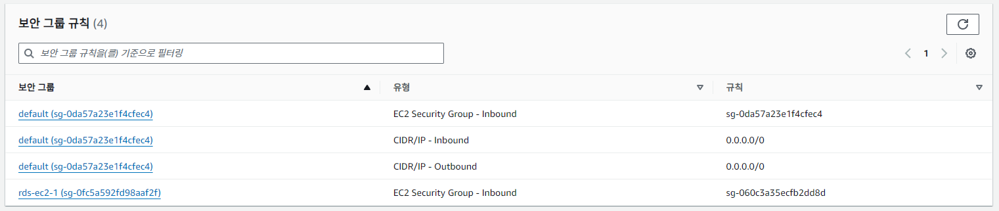
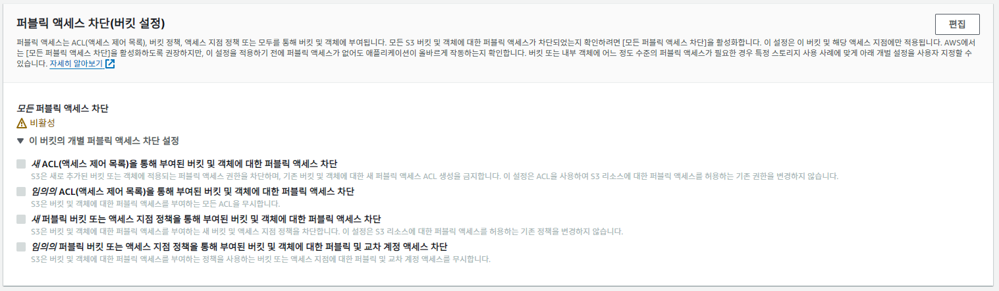
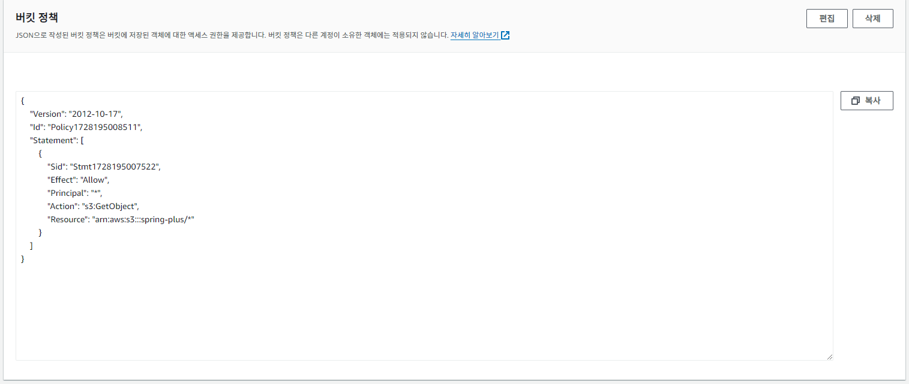
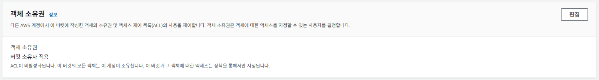
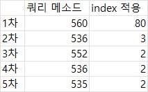
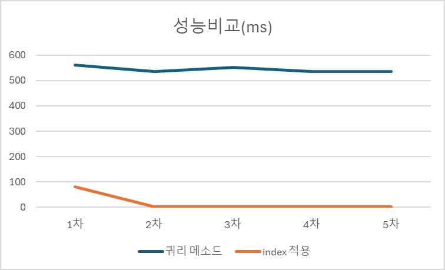

# SPRING PLUS

___

## 인스턴스 요약 정보(탄력적 IP)

## 인스턴스 보안 그룹 규칙

___

## RDS 연결된 컴퓨팅 리소스

## RDS 보안 그룹 규칙

___

## S3 퍼블릭 액세스 차단

## S3 버킷 정책

## S3 객체 소유권

___

## 추가된 API

| Method | URL                                   | Description     | Parameters                                       | Request Body | Response                                                                                                                                                                                                                                 | Status Code |
|--------|---------------------------------------|-----------------|--------------------------------------------------|--------------|------------------------------------------------------------------------------------------------------------------------------------------------------------------------------------------------------------------------------------------|-------------|
| GET    | http://localhost:8080/actuator/health | 서버 health check | 없음                                               | 없음           | {  "status" : 서버 상태  }                                                                                                                                                                                                           | 200 OK      |
| PUT    | http://localhost:8080/users/profile   | 프로필 이미지 업로드     | ?image=프로필이미지                                    | 없음           | {  "imageUrl" : 이미지 URL  }                                                                                                                                                                                                       | 200 OK      |     
| DELETE | http://localhost:8080/users/profile   | 프로필 이미지 삭제      | 없음                                               | 없음           | 없음                                                                                                                                                                                                                                       | 200 OK      | 
| GET    | http://localhost:8080/users           | 유저 닉네임 검색       | ?page=페이지번호& size=페이지사이즈& nickname=유저닉네임 | 없음           | {  "content" : [ { "id" : 유저ID,  "email" : 유저email,  "nickname" : 유저닉네임 } ], "page" : { "size" : 페이지사이즈,  "number" : 페이지번호,  "totalElements" : 조회된유저수,  "totalPages" : 전체페이지수 }  | 200 OK      |

___

## 유저 닉네임 조회 성능개선(ms)

